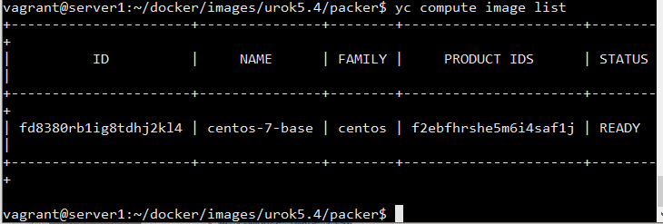
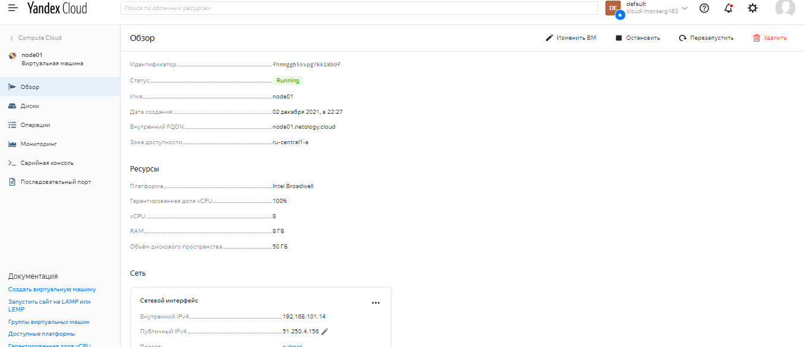
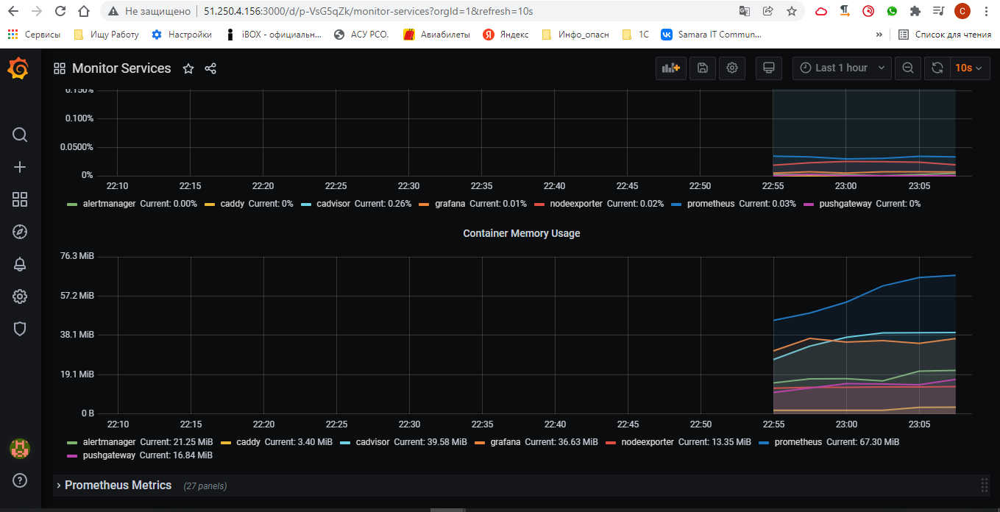

# Домашнее задание к занятию "5.4. Оркестрация группой Docker контейнеров на примере Docker Compose"

## Задача 1

Создать собственный образ операционной системы с помощью Packer.

Для получения зачета, вам необходимо предоставить:
- Скриншот страницы, как на слайде из презентации (слайд 37).
* Ответ:

  

## Задача 2

Создать вашу первую виртуальную машину в Яндекс.Облаке.
 
Удаляем подсети

	 yc vpc subnet delete --name my-subnet-a && yc vpc network delete --name net
- Скриншот 

  

## Задача 3

Создать ваш первый готовый к боевой эксплуатации компонент мониторинга, состоящий из стека микросервисов.

- Скриншот работающего веб-интерфейса Grafana с текущими метриками

  

## Задача 4 (*)

Создать вторую ВМ и подключить её к мониторингу развёрнутому на первом сервере.

Для получения зачета, вам необходимо предоставить:
- Скриншот из Grafana, на котором будут отображаться метрики добавленного вами сервера.
