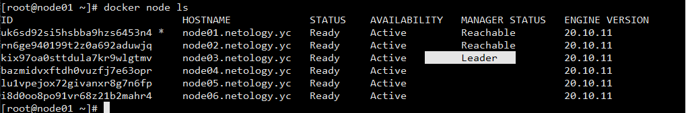
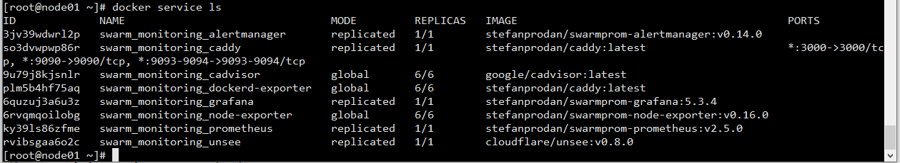

# Домашнее задание к занятию "5.5. Оркестрация кластером Docker контейнеров на примере Docker Swarm"

## Задача 1
	Дайте письменые ответы на следующие вопросы:

	В чём отличие режимов работы сервисов в Docker Swarm кластере: replication и global?
		- replication устанавливается только на необходимые ноды, пользователем указывается сколько идентичных задать требуется запустить
		- global сервис запускается одну задачу на всех нодах, например для мониторинга-снятия метрик.
	Какой алгоритм выбора лидера используется в Docker Swarm кластере?	
		- По умолчанию первой ноде присваивается роль manager, при добавлении ноды указываем ее роль. Среди менеджеров всегда присутствует один,
		который на данный момент является лидером кластера.	Все управляющие команды, которые выполняются на других менеджерах автоматически 
		перенаправляются на него. 
	
	Что такое Overlay Network?
		- создает распределенную сеть между несколькими узлами демона Докера. Эта сеть находится поверх (накладывается) на сети, зависящие от хоста,
		позволяя подключенным к ней контейнерам (включая контейнеры служб роя) безопасно обмениваться данными при включенном шифровании.

## Задача 2
	Создать ваш первый Docker Swarm кластер в Яндекс.Облаке
	yc init
	yc vpc network create --name net --labels my-label=netology --description "my first network via yc"
	yc vpc subnet create --name my-subnet-a --zone ru-central1-a --range 10.1.2.0/24 --network-name net --description "my first subnet via yc"
	packer build centos-7-base.json
	yc vpc subnet delete --name my-subnet-a && yc vpc network delete --name net
	terraform init
	terraform validate
	terraform plan
	 terraform apply -auto-approve
	
	Для получения зачета, вам необходимо предоставить скриншот из терминала (консоли), с выводом команды:
	-docker node ls
	

		
	

	
	
## Задача 3
	Создать ваш первый, готовый к боевой эксплуатации кластер мониторинга, состоящий из стека микросервисов.
		docker stack ls
		docker stack ps swarm_monitoring
	Для получения зачета, вам необходимо предоставить скриншот из терминала (консоли), с выводом команды:
	 	- docker service ls
		

		
	

	
##Задача 4 (*)
	Выполнить на лидере Docker Swarm кластера команду (указанную ниже) и дать письменное описание её функционала, что она делает и зачем она нужна:

	# см.документацию: https://docs.docker.com/engine/swarm/swarm_manager_locking/
	docker swarm update --autolock=true
	
	